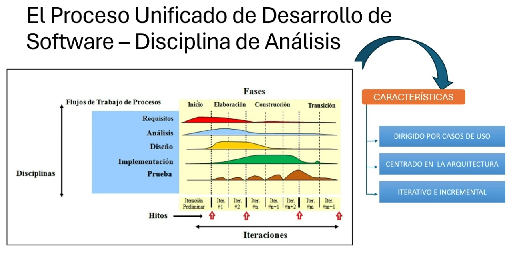
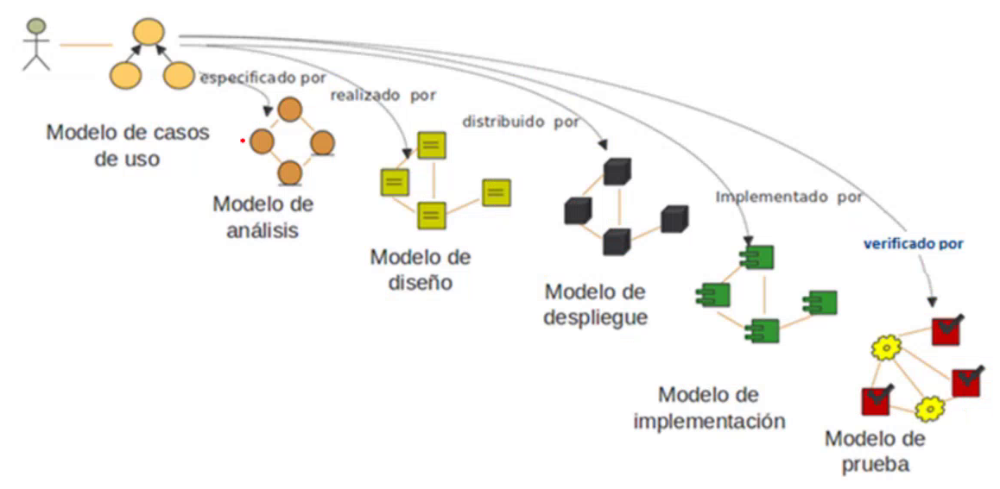

# Introducción

## Información Extra

- **Profesores:** La Rosa Fernando
- **Alumno:** Tiago Pujia
- **Comisión:** 4900 (jueves, turno noche)
- **Fecha Inicio:** 03/04/2025
- **[Clases Grabadas](https://youtube.com/playlist?list=PLENvh_JZMnA7vEGu5m39bBiGuLqVfatZW&si=JpZexpk8vJ-VKy-s)**

## Indice

- [Introducción](#introducción)
  - [Información Extra](#información-extra)
  - [Indice](#indice)
- [Clase 1 - Repaso](#clase-1---repaso)

---

# Clase 1 - Repaso

Programa: Visual Paradigm Professional
Leer capitulo 9, 10 y 11
Repaso igr

**¿Que Significa Analisis?**

Llaman a los analistas cuando hay un problema y hay:
- Oportunidad de mejora
- Necesidad
- Problema
- Resolver problema

**Proceso cognitivo de un analisis de un sistema informatico**

1. Entender problema
2. identificar componentes (requisitos)
3. identificar componente humano (requisitos humanos)
4. identificar interacciones
    - que persona interviene con cada servicio
    - como interviene
    - que cosa hacemos y como
5. resolver y revisar

Incluso, se puede comparar como ejemplo, el resultado de un medico:
1. ¿Que es lo que sentis?
2. Lo que el medico ve
3. Interpreta que puede ser
4. Que tratamiento hay
5. Se resuelve y revisa

**Entender problema**

1. Entender contexto del negocio anter de empezar el software ¿de que trata el negocio?
2. Entender contexto del problema
3. Identificar si ya hay soluciones existentes 
4. ¿Cuanta de la problematica cubre la solucion existente?

**Identificar componentes**

Un sistema se divide en varios modulos, y estos se dividen en bloques o sectores funcionales:

**Alcance del sistema - scope**

Hasta que areas puede llegar las funcionalidades del sistema

**¿Porque es necesario el analisis?**

- Objetivos
  - Necesidad cliente
  - Viabilidad
  - analisis economicos
  - ¿hay hardware y software?
  - restricciones de propuestas y planificación
- analisis de requisitos
  - problema
  - evolución
  - modelado
  - especificado
  - revisión
- Otros
  - Analisis economico y tecnico, esto se hace en viabilidad
  - Especificación sistema
  - Modelado de arquitectura
- viabilidad
  - legal
  - tecnica
  - economica ¿Cuanto cuesta?
  
**Proceso Unificado de Desarrollo de Software - Disciplina de Análisis**

Se mide por:
- Casos de uso
- Centrado en arquitectura: que datos va, sobre que plataforma, como se integra, que trabaja, etc...
- Interativo e Incremental: Se basa en 6 modelos: **Modelos del Proceso Unificado**, donde todos se dirigen al modelo de casos de uso

- Modelo de casos de uso
    1. _Especificado por:_ Modelo de analisis
    2. _Realizado por:_ Modelo de diseño
    3. _Distribuido por:_ Modelo de despliegue
    4. _Implementado por:_ Modelo de implementación
    5. _Verificado por:_ Modelo de prueba

La materia se centra en el modelo de casos de uso y una parte del analisis

---